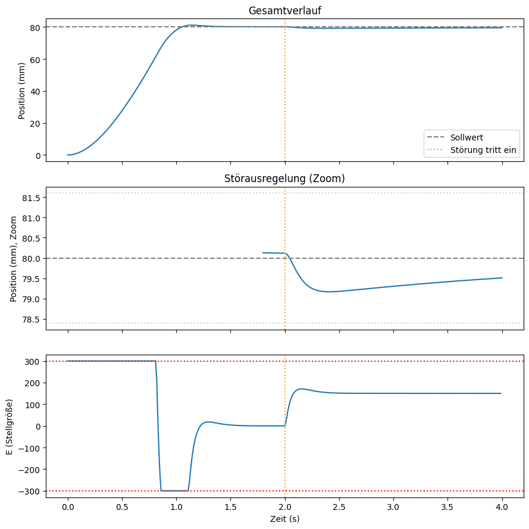

# PID Control of a Hand Prosthesis (Simulation)

Course project for *Control Engineering in Medicine* at the Medical University of Vienna.

The notebook simulates the opening and closing movement of a hand prosthesis and controls it with a discrete-time PID controller in Python.

## What's inside

- Plant model of the prosthesis as a second-order system (position and velocity), integrated with `scipy`
- Discrete-time PID controller with output saturation and anti-windup
- Gain tuning via grid search, evaluated by rise time, settling time, overshoot and steady-state error
- Robustness tests: external disturbance, different sampling times (1 to 100 ms) and ADC quantization (4 to 12 bit)

## Run it

Open `Final_Project Steuerung_und_Regelung.ipynb` in Jupyter or Google Colab. Requirements: `numpy`, `scipy`, `matplotlib`.

Code comments and plot labels are in German.
